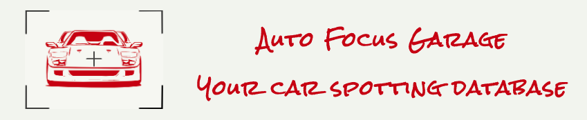
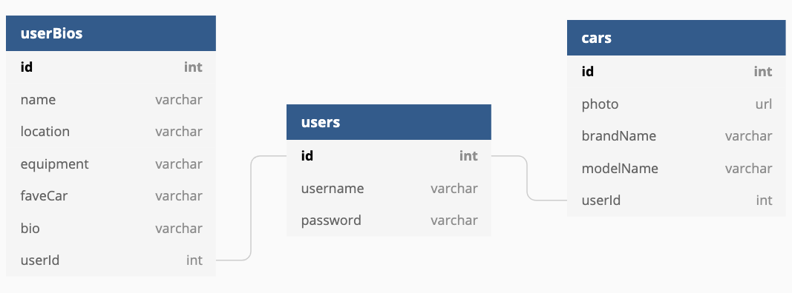

# Auto Focus Garage: Your car spotting database

A React app built by Luke Esworthy for Nashville Software School's C40 front-end capstone.

## Overview

Auto Focus Garage was conceived and built by a car enthusiast for car enthusiasts. AFG was designed to be a place where enthusiasts and photogs can go to keep track of cars they have seen. After registering/logging in, each user is able to create a personal bio and then car cards, displaying a photo, make & model names, and any additional info the user wishes to add.

## Setup

Get this app running on your local machine:

1. Clone this repo to your machine
   -`git clone https://github.com/LukeEsworthy/Auto-Focus-Garage.git`
2. `cd` into "autofocusgarage"
3. You will need an API key from [Unsplash](https://unsplash.com/). Click the link and follow the directions on the website to create an account to get your own API key.
4. In the `src` folder, create a file called `APIKeys.js`
   -`cd src`
   `touch APIKeys.js`
5. Create and export a variable `UnsplashAPIKey` and give it the value of your unique API key from Unsplash.
   i. `const UnsplashAPIKey = "YOUR-API-KEY-HERE";`
   ii. `export default UnsplashAPIKey;`
6. Make sure you have Node.js and npm installed on your machine by typing `node -v` in your terminal. If not, click [here](https://www.npmjs.com/get-npm?utm_source=house&utm_medium=homepage&utm_campaign=free%20orgs&utm_term=Install%20npm) to install it.
7. Once installed, type `npm start` in your terminal to run the server. It will start running and open a window in your browser with the app.
8. In another terminal tab, navigate into the API folder to run the json server.
   i. `cd api`
   ii. `json-server -p 5002 -w database.json`

And with that, you should be up and running!

### ERD

